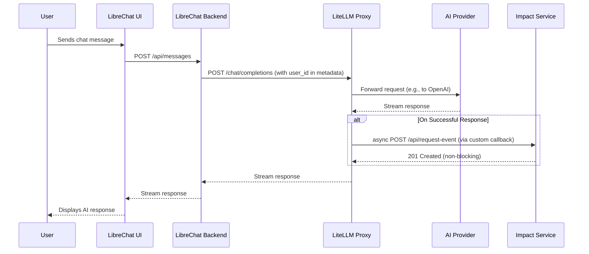

# Kick-off Research: LiteLLM Integration

This document outlines the steps and findings for the initial technical spike to integrate LiteLLM with LibreChat.

## Goal

Stand up the stack locally, confirm integration points, identify potential blockers, and produce notes for sprint planning.

## Part 1: Running LibreChat Locally

This section covers the first step of the kick-off research: getting a local instance of LibreChat running with Docker.

### 1. Prepare the Environment File

Navigate to the `LibreChat` directory and create a `.env` file from the example file:

```bash
cp .env.example .env
```

### 2. Configure Environment Variables

Open the newly created `.env` file. While there are many options, only a few are required for a basic setup:

-   **`MEILI_MASTER_KEY`**: This is required by the `meilisearch` service. A default key is provided in the `.env.example` file, which is sufficient for local development.
-   **API Keys**: To use any AI models, you will need to provide the relevant API keys. For this project, you should at least set:
    -   `OPENAI_API_KEY`
    -   `ANTHROPIC_API_KEY`
    -   `GOOGLE_KEY`
    -   `GROQ_API_KEY`

    *Note: For the initial setup, you can set these to `user_provided` to allow entering them in the UI, but for the LiteLLM integration, you will need to provide actual keys.*

-   **(Optional) User and Group IDs**: To avoid potential file permission issues with Docker volumes, it's recommended to set your user and group IDs. You can find these on Linux/macOS with the following commands:

    ```bash
    echo "UID=$(id -u)" >> .env
    echo "GID=$(id -g)" >> .env
    ```

### 3. Start the Docker Containers

Once the `.env` file is configured, you can start all the services using Docker Compose:

```bash
docker-compose up -d
```

This command will download the necessary images and start the `api` (LibreChat), `mongodb`, `meilisearch`, `vectordb`, and `rag_api` containers in the background.

### 4. Access the Application

After a minute or two for the services to initialize, you can access the LibreChat application in your browser at `http://localhost:3080` (or whichever port you have configured in your `.env` file).

## Part 2: Deploying the LiteLLM Proxy

This section covers how to set up the LiteLLM proxy to act as a central gateway for all AI models.

### 1. Install LiteLLM

If you don't have it installed already, you can install LiteLLM using pip:

```bash
pip install 'litellm[proxy]'
```

### 2. Create the LiteLLM Configuration File

LiteLLM uses a `config.yaml` file to manage its model fleet. Create a new file named `litellm_config.yaml` in a convenient location (e.g., in the root of the `aim2balance.ai` project directory).

Populate this file with the following configuration. This example sets up four providers: OpenAI, Groq, Anthropic, and a local Ollama instance.

```yaml
model_list:
  - model_name: gpt-4
    litellm_params:
      model: openai/gpt-4
      api_key: env/OPENAI_API_KEY

  - model_name: claude-3-haiku
    litellm_params:
      model: anthropic/claude-3-haiku-20240307
      api_key: env/ANTHROPIC_API_KEY

  - model_name: mixtral-8x7b
    litellm_params:
      model: groq/mixtral-8x7b-32768
      api_key: env/GROQ_API_KEY

  - model_name: llama3-local
    litellm_params:
      model: ollama/llama3
      api_base: http://host.docker.internal:11434 # Use this if Ollama is running on your host

litellm_settings:
  master_key: "sk-1234"
```

**Important Notes:**

-   The `model_name` is the alias that will be used in API requests.
-   `api_key: env/VAR_NAME` tells LiteLLM to read the API key from your environment variables.
-   For Ollama, `http://host.docker.internal:11434` allows a containerized LiteLLM to communicate with Ollama running on your host machine.

### 3. Run the LiteLLM Proxy

From your terminal, run the LiteLLM proxy and point it to your configuration file. Make sure your provider API keys are set as environment variables.

```bash
# Set your API keys in the terminal
export OPENAI_API_KEY="sk-..."
export ANTHROPIC_API_KEY="sk-..."
export GROQ_API_KEY="gsk_..."

# Run the proxy
litellm --config litellm_config.yaml --port 4000
```

This will start the proxy server on `http://localhost:4000`.

### 4. Test the Proxy

You can test that the proxy is working correctly by sending a `curl` request:

```bash
curl -X POST http://localhost:4000/chat/completions \
-H "Content-Type: application/json" \
-H "Authorization: Bearer sk-1234" \
-d '{
  "model": "gpt-4",
  "messages": [ 
    {
      "role": "user",
      "content": "Hey, hows it going?"
    }
  ]
}'
```

You should receive a successful response from the OpenAI API, routed through your LiteLLM proxy.

## Part 3: Integrating LibreChat with LiteLLM

This section explains how to configure your local LibreChat instance to send all its AI requests through the LiteLLM proxy.

### 1. Configure the OpenAI Endpoint in LibreChat

Since LiteLLM exposes an OpenAI-compatible endpoint, we can simply tell LibreChat to use our LiteLLM server as a reverse proxy for OpenAI.

Open your `.env` file in the `LibreChat` directory and add the following line:

```
OPENAI_REVERSE_PROXY=http://localhost:4000
```

**Important:** Since LiteLLM is now handling the API keys, you can set a placeholder key in your `.env` file for `OPENAI_API_KEY`. The `Authorization` header will be handled by LiteLLM using its `master_key`.

```
# In your .env file
OPENAI_API_KEY=litellm-master-key # This can be any non-empty string
```

### 2. Restart LibreChat

For the changes to the `.env` file to take effect, you need to restart the LibreChat container:

```bash
docker-compose restart api
```

### 3. Test the Integration

1.  **Open LibreChat:** Navigate to `http://localhost:3080` in your browser.
2.  **Select an OpenAI Model:** Start a new conversation and select any of the models you configured in `litellm_config.yaml` (e.g., `gpt-4`, `claude-3-haiku`, `mixtral-8x7b`).
3.  **Send a Message:** Send a test message.

If the integration is successful, you will receive a response from the selected model, and you will see the request being logged in the terminal where you are running LiteLLM.

## Part 4: Capturing Telemetry with LiteLLM Callbacks

This section covers the final and most critical step of the research: intercepting the request metadata from LiteLLM to create our `RequestEvent`.

LiteLLM's custom callback system is the perfect tool for this. We will create a Python script that defines a custom callback class and then configure LiteLLM to use it.

### 1. Create the Custom Callback Script

Create a new Python file named `litellm_callbacks.py`.

This script will define a class `Aim2BalanceCallbackHandler` that inherits from LiteLLM's `CustomLogger`. We will implement the `async_log_success_event` method, which is triggered after a successful AI model call.

```python
import requests
import os
from litellm.integrations.custom_logger import CustomLogger

# The endpoint for our future Impact Service
IMPACT_SERVICE_URL = os.getenv("IMPACT_SERVICE_URL", "http://localhost:3090/api/request-event")

class Aim2BalanceCallbackHandler(CustomLogger):
    async def async_log_success_event(self, kwargs, response_obj, start_time, end_time):
        # Extract the necessary data from the callback arguments
        user_id = kwargs.get("litellm_params", {}).get("metadata", {}).get("user_id", "unknown")
        model = kwargs.get("model", "unknown")
        cost = kwargs.get("response_cost", 0)
        
        # Get token counts from the response object
        usage = response_obj.usage
        prompt_tokens = usage.prompt_tokens
        completion_tokens = usage.completion_tokens
        
        # Calculate latency
        latency = (end_time - start_time).total_seconds()
        
        # Prepare the RequestEvent payload
        request_event = {
            "userId": user_id,
            "ts": start_time.isoformat(),
            "model": model,
            "provider": model.split('/')[0], # Simple provider extraction
            "tokens_in": prompt_tokens,
            "tokens_out": completion_tokens,
            "costEUR": cost,
            "latency": latency,
        }
        
        # Send the data to our Impact Service
        try:
            requests.post(IMPACT_SERVICE_URL, json=request_event)
            print(f"Successfully sent RequestEvent to Impact Service for user {user_id}")
        except Exception as e:
            print(f"Error sending RequestEvent to Impact Service: {e}")

```

### 2. Configure LiteLLM to Use the Callback

Now, we need to tell LiteLLM to use our new callback. We do this by adding a `litellm_settings` section to our `litellm_config.yaml` file.

```yaml
# ... (model_list from Part 2) ...

litellm_settings:
  master_key: "sk-1234"
  callbacks: ["litellm_callbacks.Aim2BalanceCallbackHandler"] # Path to our class
```

### 3. Pass User ID in Requests

For the callback to know which user made the request, we must pass the `user_id` in the `metadata` of each API call. LibreChat will need to be modified to add this to its requests to the LiteLLM proxy.

Example `curl` request showing how to pass the user ID:

```bash
curl -X POST http://localhost:4000/chat/completions \
-H "Content-Type: application/json" \
-H "Authorization: Bearer sk-1234" \
-d '{
  "model": "gpt-4",
  "messages": [{"role": "user", "content": "Hey!"}],
  "metadata": {
    "user_id": "user-12345"
  }
}'
```

## Kick-off Research Complete

This concludes the initial research spike. We have successfully:

1.  Run LibreChat locally.
2.  Deployed a LiteLLM proxy with multiple AI providers.
3.  Integrated LibreChat with LiteLLM.
4.  Identified the mechanism (custom callbacks) for capturing the required telemetry data.

The project is now ready for sprint planning and full implementation.

## Deliverables

-   A short README with setup steps, environment variables, and sample `curl` commands.
-   A sequence diagram illustrating the request flow from LibreChat -> LiteLLM -> AI Provider.

## Sequence Diagram

This diagram illustrates the full request and telemetry flow for the aim2balance.ai platform.


